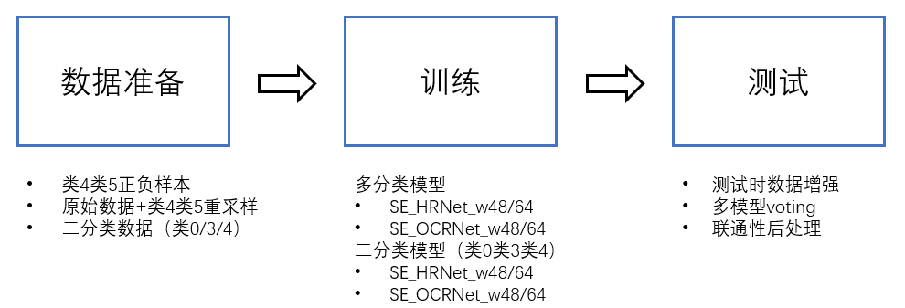
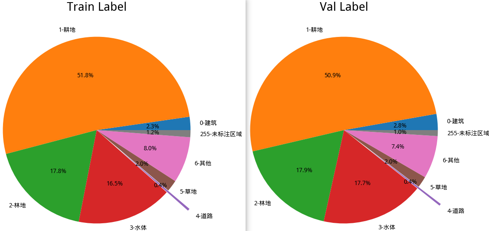
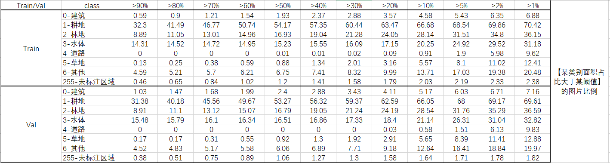
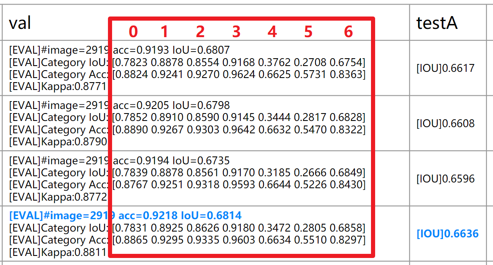
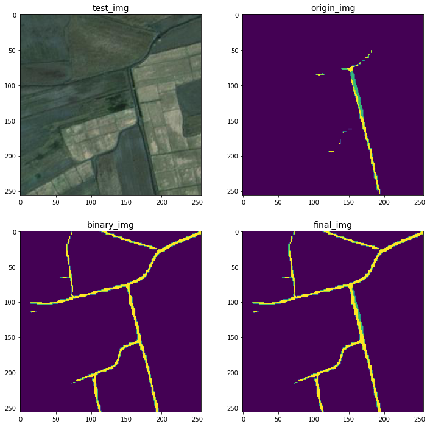
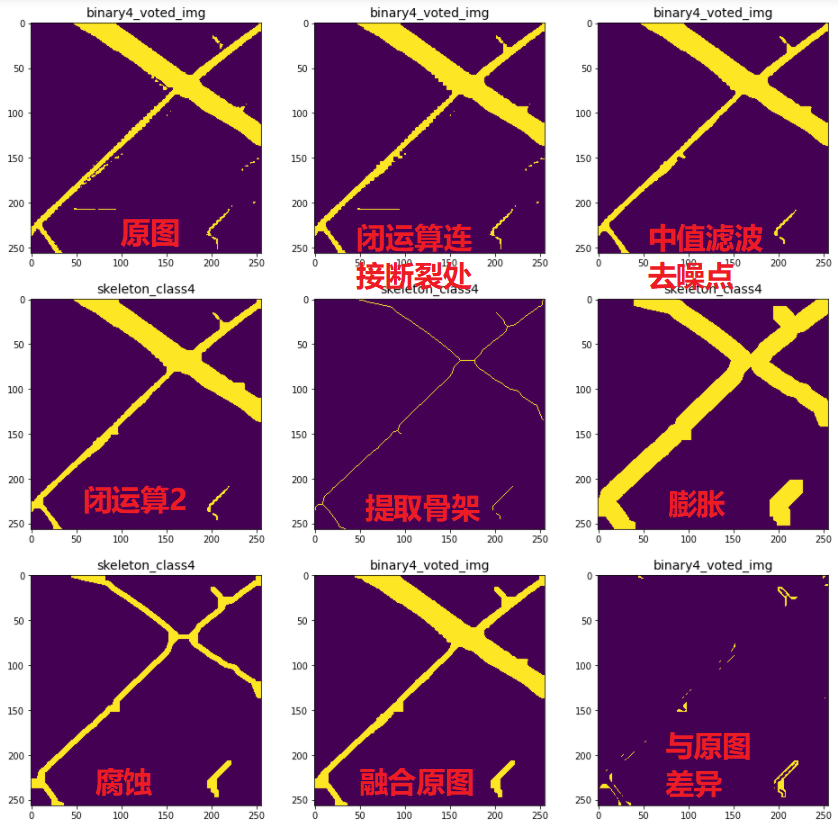
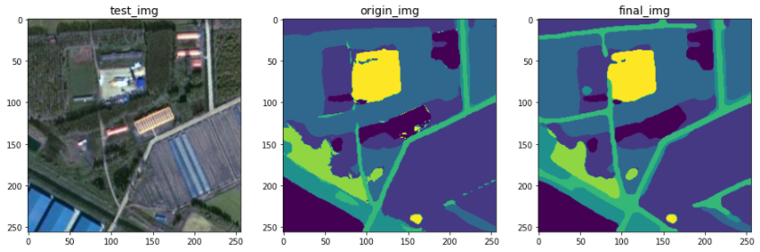

# CCF遥感影像地块分割

**Team:paddle针不戳**

|      | 初赛（Top2） | 复赛（Top1） |
| ---- | ------------ | ------------ |
| A榜  | 0.73418844   | 0.71751271   |
| B榜  | 0.74324144   | 0.71104908   |

## 解决方案

### 整体框架

整体框架如上图所示，主要分为数据准备、训练和测试三大部分，下面逐一讲解。

### 数据准备

#### 数据分析

按照官方脚本划分训练集与验证集，统计整个数据集中每类像素面积占比、单张图片满足面积阈值条件占比如下

忽视类255-未标注区域，可以发现：

1. 各类像素面积占比上，**类0-建筑、类4-道路、类5-草地面积占比最少**，类1-耕地、类2-林地、类3-水体面积占比最多；
2. 数据集分布上，只有约7%的图片满足类0-建筑的占比大于1%（即$256\times 256\times0.01 \approx 655$像素），约10%的图片满足类4-道路，约13%的图片满足类5-草地占比大于1%。

#### baseline结果分析

不同参数训练官方提供的UNet baseline结果如下所示

比较每类训练结果以及前面分析的数据可以发现：

1. 类0-建筑尽管数据不多，但结果相对较好，可能的原因是建筑类往往成片且特征明显（屋顶与其他地貌有明显差异）；
2. 类4-道路与类-5草地的结果很差，最可能的原因是数据的不均衡分布导致模型倾向于预测出现次数多的类。

#### 数据处理

综上所述，有必要**针对类4和类5进行数据增强**，有两种解决方案：

1. **修改dataloader，划分类4类5正负样本**：以类4为例，这里的正样本指包含类4的图片，负样本指不包含类4的图片。因此我们需要筛选出仅包含类4类5的照片，考虑到某类面积过少不利于模型训练，这里设定一定**阈值**（如0.01）筛选图片。再者为了扩大正样本，我们对筛选后的图片进行了**数据增强（水平/垂直翻转+随机旋转90/180/270）**。划分正负样本后，可进行**多阶段训练，逐渐增大负样本比例**，由简单到复杂训练模型（参考Curriculum learning）。
2. **类4类5重采样**：在原始数据集的基础上，对类4类5样本进行重采样，生成更大规模的数据集，直接增大数据集中类4类5的比例。考虑到重复样本训练可能导致过拟合，这里我们对阈值筛选后的包含类4类5的图片（同1）进行**数据增强（水平/垂直翻转+随机旋转90/180/270+resize192/224/288/320）**，利用生成的更大的数据集直接训练模型。

以上两种方案均能带来一定的提升，其中第二种方案效果更好，由于最后采用多模型融合预测结果，将上述两种方案训练的模型都进行了融合。

在复赛中，我们发现**借助二分类模型对像素更精确的分类，进行模型融合可以很好地类3类4的联通性**，如下所示，将二分类的预测直接覆盖原始多分类预测可以很好地增强类3类4的联通性：

因此，我们针对类3类4训练了二分类模型，同时我们注意到类0和类5的结果有提升的可能，同样进行了二分类模型尝试，实验结果发现，二分类模型对类5效果较差，而在类0类3类4上均有明显提升，如下**制作二分类数据**：

- 同上所述，对类0类3类4进行**阈值筛选**，对筛选后的图片我们进行了一定的**数据增强（水平/垂直翻转+随机旋转90/180/270+resize192/224/288/320）**，我们**仅保留label中对应的类作为前景（设置像素为1），其余类作为背景（设置为0）**，同样地，我们进行**多阶段训练，逐渐增大负样本比例**，由简单到复杂训练模型。

### 训练多分类模型与二分类模型

我们首先在UNet baseline上探索了合适的超参数（包括lr、batch_size、decaying schedule、optimizer、data augumentation等等），之后我们采用了HRNet_w18/32作为进一步调参模型，最后为了追求精度，**我们主要采样了HRNet_w48/64以及更新的OCRNet_w48/64，考虑到实际中的模型开销，可以采用多个小模型进行融合实现较佳的权衡。**

在backbone的基础上，我们探索了**不同注意力机制**的影响，包括SE、CBAM、SCSE等，实验结果发现SE带来的提升更为明显，因此**我们在最终采用的模型中都加入了SE模块**。

对于数据增强，我们借助albumentations库进行了多种尝试，最后使用了**水平翻转、垂直翻转、运动模糊、高斯模型、小角度（顺时针逆时针15度）旋转、（针对二分类模型）随机旋转90/180/270和z-score归一化**。

对于正负样本数据集，我们采用了多阶段训练方法，逐步增大负样本比例，并适当减小学习率，实验发现二阶段训练效果较好，更多阶段的训练提升并不明显。

### 测试与结果生成

测试时主要包含两次多模型voting：

1. **全分类模型voting**：对于多模型融合，我们并不采样softmax分数进行求和求最大”soft voting“，而是**直接生成每个模型的预测结果，逐个像素进行少数服从多数的”hard voting"**。再者模型融合时，最好采用不同结构、不同方法训练的模型，**我们在比赛中阶段性地融合了彼时训练出来的最佳模型（最后共9个），在实际应用中可以选择性训练4-5个模型，随着模型的增加，提升的幅度越来越小**。并且，**对不同方法训练的模型，可以选择性地为不同类设计voting权重**，如增大类4类5比例训练的模型可适当增加其判断为类4类5的权重。最后我们**进行了测试时增强（原图水平翻转+垂直翻转+旋转180度，resize288/320），不同尺度不同增强共12种输入**，由于我们训练时没有对全分类模型进行随机旋转90/180/270增强，因此对测试也没有采用。**实际中考虑voting所花时间，可仅采用4种输入（原图+水平翻转+垂直翻转+旋转180度）**，在验证集上效果相差毫厘。
2. **二分类模型voting**：在复赛中，我们加入了二分类模型以增强模型的连通性，考虑连通性的特殊性，我们**测试时增强使用了30种输入（原图水平翻转+垂直翻转+旋转90/180/270，resize288/320/352/384）**，**对于每个像素设计较小的阈值，当多图对该像素的判断大于该阈值，则判定为对应类**。**实际中考虑voting所花时间，可仅采用4种输入（原图+水平翻转+垂直翻转+旋转180度）**，在验证集上效果相差无几。

针对连通性，我们设计了多种后处理：

1. **闭运算**连接断裂处，**中值滤波**去除部分噪点和毛刺。

2. **去除原图、二分类图像孤立团**：**计算不同连通区域面积和长度**，设定一定阈值判断，小于阈值则**使用左边像素进行填充**。

3. **骨架连通性增强**：如下图所示，我们对原图进行**闭运算连接断裂处**，接着**提取骨架**，并使用**膨胀腐蚀**对骨架进行一定的增强，最后与原预测融合。

4. 结合人的先验与实际预测，道路一般被水体包围，并且水体的准确率和IOU较高，我们**先融合了类3，再融合了类4进行覆盖**，考虑部分图片特殊性（道路包围水体），我们**结合原图进行了覆盖性检测，动态地决定类3类4的融合顺序**。

   

### 结果展示

上图中，中间为原始预测，右图为二分类voting及后处理后的预测，可以发现**后处理后，预测的噪点更少，类3类4的连通性更强**。
